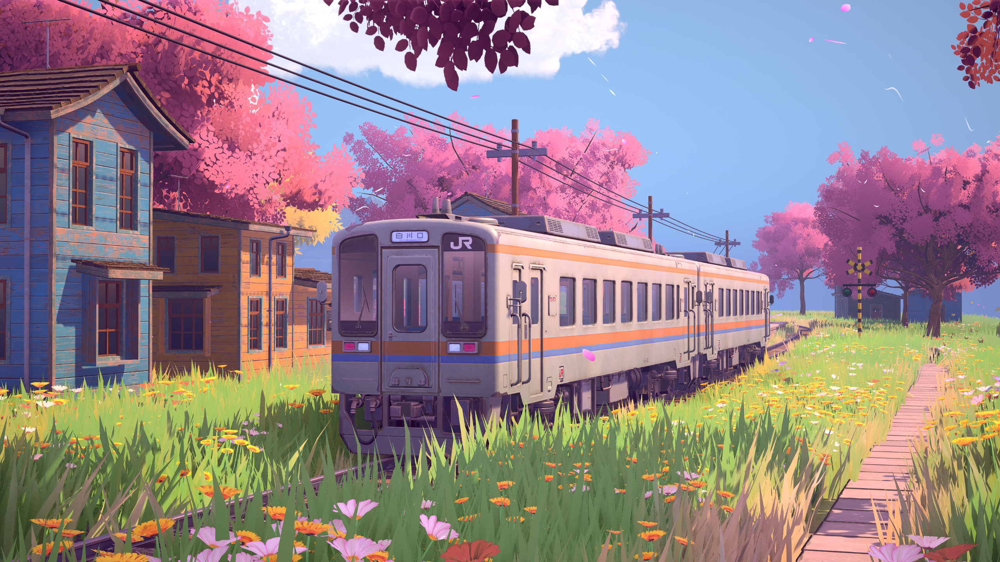

<link rel="preload" as="image" href="../../theme-default.webp" type="image/webp" media="(min-width: 769px)">
<link rel="preload" as="image" href="../../liumin.webp" type="image/webp" media="(max-width: 768px)">

  <picture>
    <source media="(max-width: 768px)" srcset="../../liumin.webp" type="image/webp">
    <source media="(max-width: 768px)" srcset="../../liumin.JPG">
    <source media="(min-width: 769px)" srcset="../../theme-default.webp" type="image/webp">
    
  </picture>

<section class="kalxr-section kalxr-hero" id="kalxrHero">
  

  

    <h1 class="kalxr-main-title">LIUMIN</h1>
    

      

        
      

    

    <a class="kalxr-hero-link" href="../../about/">走入回忆</a>
  

</section>

